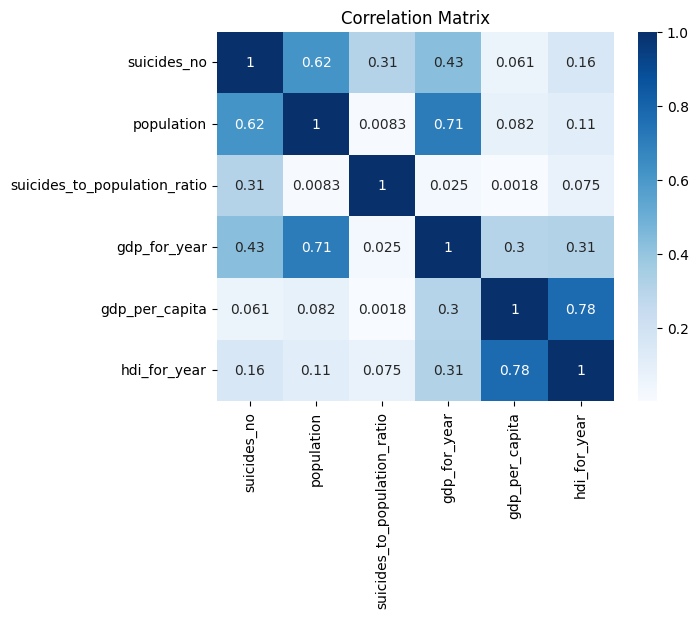
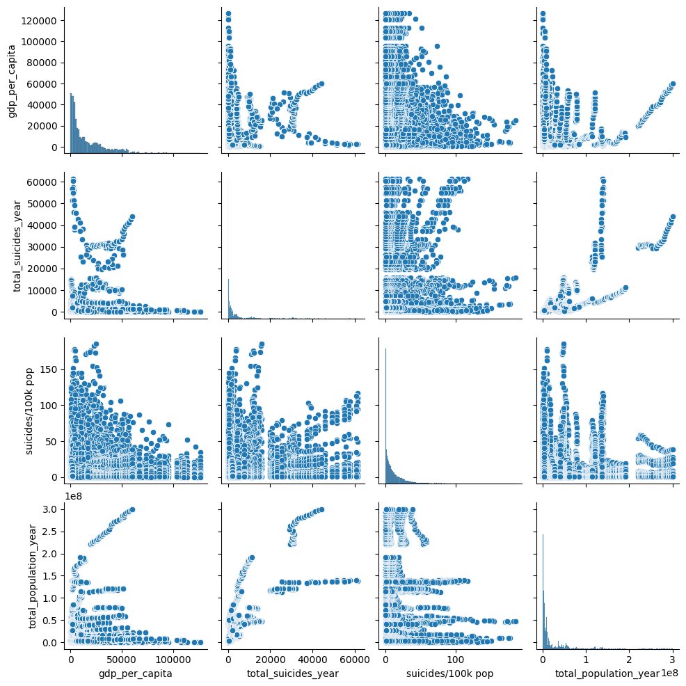
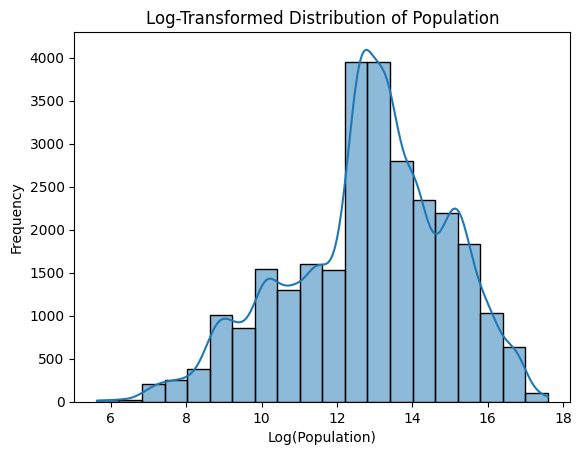
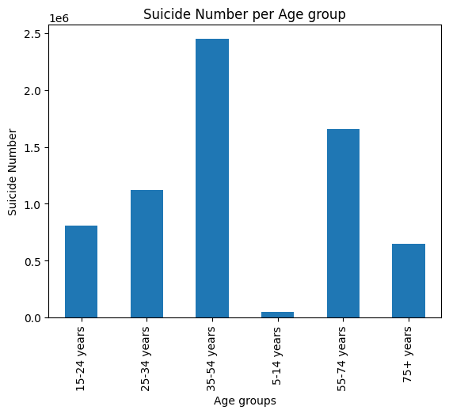

# Universiteti i Prishtinës "Hasan Prishtina"

<div align="center">
  
</div>

<div align="center">
<b>Fakulteti: Fakulteti i Inxhinierisë Elektrike dhe Kompjuterike</b><br>  
<b>Departamenti: Departamenti i Inxhinierisë Kompjuterike</b>
<b>Lënda: Përgatitja dhe vizualizimi i të dhënave</b>
</div>
<br>

## Pjesëmarrësit në Projekt

**Studentët** që kanë marrë pjesë në këtë projekt janë:
- Endrit Hoda
- Lorik Mustafa
- Meriton Kryeziu

**Profesori**: Mërgim Hoti

# Data Processing and Visualization: Suicide Rates Overview (1985-2016)

Ky repository përdoret për qëllime studimore në fushën e Përgatitjes dhe Vizualizimit të të Dhënave, për një analizë të thellë të normave të vetëvrasjeve nga viti 1985 deri në vitin 2016.

## Përshkrimi i Datasetit

Dataseti që do të përdoret është marrë nga Kaggle dhe përmban një numër të madh të dhënash me madhësi prej 2.71 MB. Ky dataset është i përbërë nga të dhëna të marra nga katër burime të ndryshme dhe është i lidhur sipas kohës dhe vendit. Ai është ndërtuar për të identifikuar sinjale që mund të jenë të lidhura me rritjen e normave të vetëvrasjeve në grupe të ndryshme demografike globalisht, duke përfshirë spektrin socio-ekonomik.

## Objektivat e Projektit

Qëllimi i këtij projekti është përgatitja dhe vizualizimi i të dhënave për të analizuar normat e vetëvrasjeve për grupe të ndryshme demografike dhe faktorë socio-ekonomikë në vite të ndryshme. Më konkretisht, projekti do të fokusohet në:

- **Norma e vetëvrasjeve sipas segmentimeve demografike**: Analiza e normave të vetëvrasjeve për grupe të ndryshme demografike, si mosha, gjinia dhe gjenerata. Kjo na ndihmon të identifikojmë cilat grupe moshe ose gjenerata janë më të ndjeshme ndaj vetëvrasjes në vite të caktuara. Gjithashtu, do të shohim nëse ka një dallim të dukshëm mes meshkujve dhe femrave brenda secilit grup.

- **Korelacioni midis GDP për capita dhe normës së vetëvrasjeve**: Analiza e lidhjes midis faktorëve ekonomikë, si GDP për capita, dhe normës së vetëvrasjeve. Krahasimi i `gdp_per_capita` me `suicides/100k pop` mund të identifikojë trende ku kushtet ekonomike lidhen me norma të ndryshme të vetëvrasjeve në vite dhe segmente të caktuara.

- **Tendencat me kalimin e kohës**: Ndjekja e ndryshimeve në normat e vetëvrasjeve gjatë viteve për të parë modelet ose ndryshimet e mundshme. Ky segmentim sipas shtetit, grupmoshës ose gjeneratës na ndihmon të kuptojmë ndikimin e ndryshimeve shoqërore apo ngjarjeve historike në shëndetin mendor me kalimin e kohës.

Ky projekt synon të sjellë një kuptim më të thellë të faktorëve që ndikojnë në shëndetin mendor globalisht përmes përgatitjes dhe vizualizimit të të dhënave. 

## Ekzekutimi i Kodit Hap pas Hapi

Ja një shpjegim i secilës pjesë të kodit të përdorur në këtë projekt:

# Udhëzues për Ngarkimin dhe Inspektimin e të Dhënave

### 1. Ngarkimi dhe Inspektimi i të Dhënave
- **Përshkrim**: Dataseti ngarkohet duke përdorur Pandas, dhe llojet e të dhënave dhe statistikat përmbledhëse printohen për të kuptuar strukturën fillestare.


### 2. Modifikimi i Llojeve të të Dhënave
- **Transformimi**: Kolona `gdp_for_year` përmban presje dhe konvertohet në formatin e plotë.


### 3. Reduktimi i Dimensionalitetit
- **Veprimi**: Zgjidhni një nëngrup kolonash të rëndësishme për analizë.
```python
['country', 'year', 'gender', 'age', 'suicides_no', 'population', 'suicides/100k pop', 'gdp_for_year', 'gdp_per_capita', 'hdi_for_year']
```

### 4. Menaxhimi i Vlerave të Mungesave
- **Qasja**: Përdorni mbushjen përpara dhe mbrapa për vlerat e mungesave në kolonën `hdi_for_year`.


### 5. Mostrimi i të Dhënave
- **Veprimi**: Nxirrni një mostër të rastësishme (10%) të të dhënave për analizë.


### 6. Kontrollimi për Duplikata
- **Validimi**: Kontrolloni dhe hiqni rreshtat e duplikuar.
```
Nuk u gjetën duplikata. DataFrame mbetet i pandryshuar.
```
- **Kontroll i Plotë i DataFrame-it**:
```
Nuk u gjetën duplikata.
```

### 7. Llogaritja e Metrikave të Reja, Transformimi i të dhënave
- **Transformimet**: Llogaritni kolona të reja për analizë.


### 8. Diskretizimi i të Dhënave
- **Qëllimi**: Kategorizoni variablat e vazhdueshme në grupe kuptimplota.


### 9. Binarizimi i Kolonës `gender`
- **Transformimi**: Konvertoni kolonën `gender` në vlera binare.


### 10. Detektimi i outliers
- **Veprimi**: Detektimi i outliers permes metodes Z-Score duke kalkuluar vleren per kolonat: `"suicides_no", "population", "suicides_to_population_ratio", "gdp_for_year", "gdp_per_capita", "hdi_for_year"` gjejme se jane detektuar gjitesej 221 outliers per keto kolona. 
```
Number of outliers: 221
Outliers
                     country  year gender          age  suicides_no  \
324     Antigua and Barbuda  1990   male  35-54 years            1   
360     Antigua and Barbuda  1993   male  25-34 years            1   
420     Antigua and Barbuda  2000   male  55-74 years            1   
432     Antigua and Barbuda  2001   male  35-54 years            2   
456     Antigua and Barbuda  2003   male  55-74 years            1   
...                     ...   ...    ...          ...          ...   
26464  United Arab Emirates  2010   male    75+ years            1   
27232               Uruguay  1986   male    75+ years           38   
27244               Uruguay  1987   male    75+ years           36   
27256               Uruguay  1988   male    75+ years           33   
27364               Uruguay  1999   male    75+ years           66   
```

### 11. Fshirja e outliers pas detektimit
Pas detektimit të outliers, rreshtat me outliers mund ti largojmë nga dataset-i jonë dhe ndryshimet i ruajm në një filë të ri `cleaned_data_without_outliers.csv`
```python
df = df.drop(outliers.index)
df.reset_index(drop=True, inplace=True)

df.to_csv('cleaned_data_without_outliers.csv', index=False)
```

### 12. Korrelacioni i shfaqur ne matrice
Korrelacioni mes koloneve me vlera numerike është shfaqur në formë matricore, në këte matrice shihet korrelacioni i larte mes kolonave të ngjashme (p.sh `hdi_for_year` dhe `gdp_per_capita`, `gdp_for_year` dhe `population`)



### 13. Eksplorimi i Relacioneve Multivariante
Relacionet multivariante për rastet e vetëvrasjeve dhe popullsisë është shfaqur në forme matricore me pairplot për kolonat: `'gdp_per_capita', 'total_suicides_year', 'suicides/100k pop', 'total_population_year'`



### 14. Shperndarja e popullsise permes histogramit
Për kolonën e popullsisë është shfaqur shpërndarja pas log-transformimit të vlerës së lexuar



### 15. Shperndarja e rasteve ne baze te grup-moshave
Për kolonën e moshës është shfaqur vlera e rasteve të vetëvrasjeve për grup-moshat e lexuara

